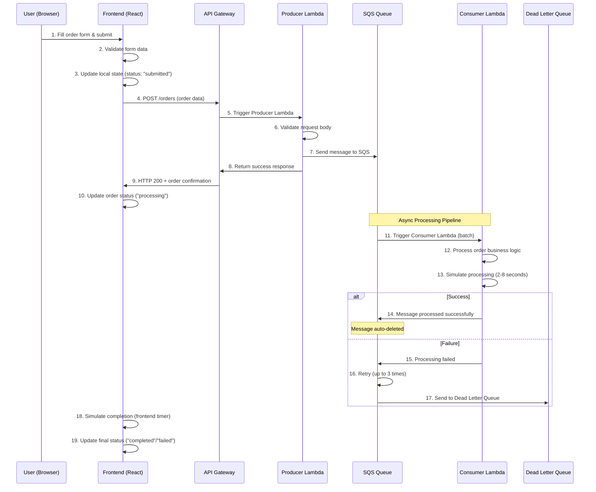

# 🛒 AWS SQS Order Management System

A comprehensive, enterprise-grade order management system built with AWS CDK, featuring serverless architecture, real-time processing, and advanced analytics dashboard.


## 🚀 Features

### Backend (AWS Serverless)

- ✅ **Serverless Architecture** with AWS Lambda and SQS
- ✅ **Infrastructure as Code** using AWS CDK
- ✅ **Reliable Message Processing** with Dead Letter Queue
- ✅ **RESTful API** with API Gateway and CORS support
- ✅ **Error Handling** and retry mechanisms
- ✅ **Scalable Processing** with configurable batch sizes

### Frontend (React TypeScript)

- ✅ **Advanced Order Form** with dynamic item management
- ✅ **Real-time Order Tracking** with status updates
- ✅ **Comprehensive Analytics Dashboard** with business metrics
- ✅ **Advanced Filtering & Search** across multiple fields
- ✅ **Data Export** functionality (JSON format)
- ✅ **Local Storage Persistence** for data retention
- ✅ **Random Data Generation** for testing
- ✅ **Responsive Design** for mobile and desktop

### Order Management Features

- 📋 **Multi-item Orders** with quantity and pricing
- 🔄 **Order Lifecycle** (Submitted → Processing → Completed/Failed)
- 🎯 **Priority Levels** (Low, Medium, High, Urgent)
- 👥 **Customer Information** tracking
- 📊 **Business Analytics** with KPIs and metrics
- 📈 **Performance Monitoring** with processing times
- 🔍 **Advanced Search** and filtering capabilities

## 🏗️ Architecture

### System Overview

```
┌─────────────────┐    ┌─────────────────┐    ┌─────────────────┐    ┌─────────────────┐
│   React Frontend │────│   API Gateway   │────│ Producer Lambda │────│   SQS Queue     │
└─────────────────┘    └─────────────────┘    └─────────────────┘    └─────────────────┘
                                                                               │
                                                                               ▼
┌─────────────────┐    ┌─────────────────┐    ┌─────────────────┐    ┌─────────────────┐
│   Analytics     │    │  Order History  │    │ Consumer Lambda │────│ Dead Letter Queue│
└─────────────────┘    └─────────────────┘    └─────────────────┘    └─────────────────┘
```

### AWS Resources

- **API Gateway**: REST API for order submission
- **Lambda Functions**: Producer (HTTP→SQS) and Consumer (SQS→Processing)
- **SQS Queue**: Reliable message queuing with visibility timeout
- **Dead Letter Queue**: Error handling for failed messages
- **IAM Roles**: Least-privilege access policies

### Frontend Architecture

- **React Components**: Modular, reusable UI components
- **TypeScript**: Type safety and better development experience
- **CSS3**: Modern styling with Grid, Flexbox, and animations
- **Local Storage**: Client-side data persistence
- **State Management**: React hooks for complex state handling

## � Technical Workflow - How It Works

### End-to-End Order Processing Flow



### 🔧 Detailed Technical Components

#### 1. **Frontend State Management Flow**

```
User Input → Form Validation → Local State Update → API Call → Response Handling → UI Update
```

**Key Technologies:**

- **React Hooks**: `useState` for form state, `useEffect` for lifecycle
- **useMemo**: Performance optimization for filtering/sorting
- **TypeScript Interfaces**: Type safety for order data
- **Local Storage**: Persistence across browser sessions

#### 2. **AWS CDK Infrastructure Provisioning**

```
CDK Code → CloudFormation Template → AWS Resources → IAM Policies → Service Integration
```

**Resource Creation Order:**

1. **Dead Letter Queue** (DLQ) - Error handling
2. **Main SQS Queue** - Message processing with DLQ reference
3. **Producer Lambda** - HTTP endpoint handler
4. **Consumer Lambda** - SQS message processor
5. **API Gateway** - REST API with CORS
6. **IAM Roles** - Least-privilege permissions

#### 3. **Message Processing Pipeline**

**Producer Lambda Workflow:**

```typescript
HTTP Request → CORS Headers → Body Validation → SQS SendMessage → Response Generation
```

**Key Operations:**

- Input validation (orderId required)
- JSON parsing with error handling
- SQS message serialization
- CORS header injection
- Error logging for debugging

**Consumer Lambda Workflow:**

```typescript
SQS Event → Batch Processing → Business Logic → Success/Failure → Message Acknowledgment
```

**Key Operations:**

- Batch message processing (up to 10 messages)
- JSON deserialization
- Simulated business logic execution
- Error handling with retry mechanism
- Automatic message deletion on success

#### 4. **Error Handling & Resilience**

**Multi-Layer Error Handling:**

```
Frontend Validation → API Gateway Errors → Lambda Exceptions → SQS Retries → Dead Letter Queue
```

**Resilience Patterns:**

- **Circuit Breaker**: Frontend handles API failures gracefully
- **Retry Logic**: SQS automatically retries failed messages
- **Dead Letter Queue**: Captures permanently failed messages
- **Exponential Backoff**: Built into SQS retry mechanism
- **Graceful Degradation**: Frontend works offline with local storage

#### 5. **Data Flow & State Synchronization**

**Frontend Data States:**

```
Form Input → Validation → Submission → API Response → Local Storage → UI Rendering
```

**Order Lifecycle States:**

1. **"submitted"** - Form submitted, added to local state
2. **"processing"** - API call successful, message in SQS
3. **"completed"** - Processing finished successfully
4. **"failed"** - Processing failed after retries

#### 6. **Performance Optimizations**

**Frontend Performance:**

- **useMemo**: Expensive filtering/sorting operations cached
- **Component Memoization**: Prevent unnecessary re-renders
- **Lazy Loading**: Components loaded on demand
- **Local Storage**: Reduce API calls for historical data

**Backend Performance:**

- **Lambda Cold Start**: Minimized with proper bundling
- **SQS Batch Processing**: Up to 10 messages per invocation
- **Parallel Processing**: Multiple Lambda instances for high load
- **Connection Pooling**: AWS SDK connection reuse

#### 7. **Security Implementation**

**Frontend Security:**

```
Input Sanitization → HTTPS Only → CORS Validation → No Sensitive Data Storage
```

**Backend Security:**

```
IAM Roles → VPC Integration → CloudWatch Logging → Least Privilege Access
```

**Security Layers:**

- **API Gateway**: CORS protection, throttling
- **Lambda**: Isolated execution environment
- **SQS**: Message encryption in transit
- **IAM**: Fine-grained permissions
- **CloudWatch**: Audit logging

#### 8. **Monitoring & Observability**

**Metrics Collection:**

```
CloudWatch Metrics → Lambda Logs → SQS Queue Depth → API Gateway Access Logs
```

**Key Metrics Monitored:**

- **Lambda Duration**: Processing time per function
- **Error Rate**: Failed invocations percentage
- **Queue Depth**: Messages waiting in SQS
- **API Latency**: Response time measurements
- **DLQ Messages**: Failed processing indicators

## �📋 Prerequisites

- **Node.js** 18+ and npm
- **AWS CLI** configured with appropriate credentials
- **AWS CDK** installed globally (`npm install -g aws-cdk`)
- **TypeScript** knowledge for customization

## 🚀 Quick Start

### 1. Clone and Setup

```bash
git clone <your-repo-url>
cd aws-sqs-order-management
```

### 2. Deploy AWS Infrastructure

```bash
cd first-sqs-stack
npm install
npx cdk bootstrap  # First time only
npx cdk deploy
```

**Note the API Gateway URL** from the deployment output.

### 3. Setup Frontend

```bash
cd ../frontend
npm install
```

Update the API endpoint in `src/services/api.ts`:

```typescript
const API_BASE_URL = "YOUR_API_GATEWAY_URL";
```

### 4. Start Development Server

```bash
npm start
```

Visit `http://localhost:3000` to access the application.

## 📁 Project Structure

```
aws-sqs-order-management/
├── first-sqs-stack/                 # AWS CDK Infrastructure
│   ├── lib/
│   │   └── first-sqs-stack.ts      # CDK stack definition
│   ├── src/lambda/
│   │   └── handler.ts              # Lambda functions (producer/consumer)
│   ├── bin/
│   │   └── first-sqs.ts           # CDK app entry point
│   └── package.json
├── frontend/                        # React TypeScript Frontend
│   ├── src/
│   │   ├── components/
│   │   │   ├── OrderForm.tsx       # Order submission form
│   │   │   ├── OrderHistory.tsx    # Order display and management
│   │   │   ├── OrderFilter.tsx     # Advanced filtering
│   │   │   └── OrderAnalytics.tsx  # Business intelligence dashboard
│   │   ├── services/
│   │   │   └── api.ts             # API communication layer
│   │   └── App.tsx                # Main application component
│   └── package.json
├── test-api.js                     # API testing script
└── README.md
```

## 🎯 Usage Guide

### Submitting Orders

1. **Fill Order Details**: Customer info, priority level
2. **Add Items**: Multiple items with quantities and prices
3. **Generate Test Data**: Use the 🎲 button for random data
4. **Submit**: Order goes through the complete lifecycle

### Tracking Orders

- **Real-time Updates**: Watch orders progress through statuses
- **Order History**: View all submitted orders with details
- **Status Indicators**: Visual feedback for order states

### Analytics Dashboard

- **Order Metrics**: Completion rates, processing times
- **Priority Analysis**: Distribution of order priorities
- **Customer Insights**: Top customers and order patterns
- **Financial Metrics**: Revenue tracking and averages

### Advanced Features

- **Search & Filter**: Find orders by multiple criteria
- **Date Range Filtering**: Analyze orders by time periods
- **Data Export**: Download filtered data as JSON
- **Sorting Options**: Multiple sort fields and directions

## 🛠️ Configuration

### AWS Configuration

- **Region**: Default `us-east-2` (configurable in CDK)
- **SQS Settings**: 30-second visibility timeout, 3 retry attempts
- **Lambda Runtime**: Node.js 22.x
- **API Gateway**: CORS enabled for all origins (development)

### Frontend Configuration

- **API Endpoint**: Update in `src/services/api.ts`
- **Local Storage**: Automatic data persistence
- **Responsive Breakpoints**: Mobile-first design

## 🧪 Testing

### Backend Testing

```bash
cd first-sqs-stack
npm test
```

### API Testing

```bash
node test-api.js
```

### Frontend Testing

```bash
cd frontend
npm test
```

## 📊 Monitoring & Observability

### CloudWatch Logs

- Lambda function logs for debugging
- API Gateway access logs
- SQS queue metrics

### Application Metrics

- Order processing times
- Success/failure rates
- Queue depth monitoring

## 🔧 Customization

### Adding New Order Fields

1. Update `OrderFormData` interface in `OrderForm.tsx`
2. Modify form UI and validation logic
3. Update analytics calculations if needed

### Extending Analytics

1. Add new metrics in `OrderAnalytics.tsx`
2. Create additional visualization components
3. Update filtering logic for new data points

### AWS Resource Customization

1. Modify `first-sqs-stack.ts` for infrastructure changes
2. Update Lambda functions for new business logic
3. Redeploy with `npx cdk deploy`

## 🚀 Deployment

### Production Deployment

1. **Update CORS Settings**: Restrict origins in production
2. **Environment Variables**: Configure for production environment
3. **Monitoring**: Set up CloudWatch alarms and dashboards
4. **Security**: Review IAM policies and API authentication

### CI/CD Pipeline

Consider setting up GitHub Actions or AWS CodePipeline for automated deployments.

## 🤝 Contributing

1. Fork the repository
2. Create a feature branch (`git checkout -b feature/amazing-feature`)
3. Commit changes (`git commit -m 'Add amazing feature'`)
4. Push to branch (`git push origin feature/amazing-feature`)
5. Open a Pull Request

## 📝 License

This project is licensed under the MIT License - see the [LICENSE](LICENSE) file for details.

## 🆘 Troubleshooting

### Common Issues

**CDK Deployment Fails**

- Ensure AWS credentials are configured
- Check CDK version compatibility
- Verify IAM permissions

**Frontend API Errors**

- Verify API Gateway URL is correct
- Check CORS configuration
- Confirm Lambda functions are deployed

**Orders Not Processing**

- Check CloudWatch logs for Lambda errors
- Verify SQS queue configuration
- Monitor Dead Letter Queue for failed messages

### Support

For issues and questions:

1. Check the troubleshooting section above
2. Review CloudWatch logs for errors
3. Open an issue with detailed error information

## 🙏 Acknowledgments

- AWS CDK team for excellent Infrastructure as Code tools
- React team for the amazing frontend framework
- AWS SQS for reliable message queuing

---

**Built with ❤️ using AWS CDK, React, and TypeScript**
